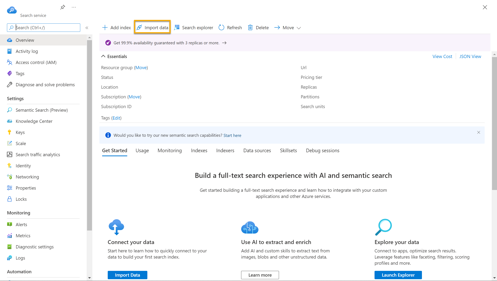
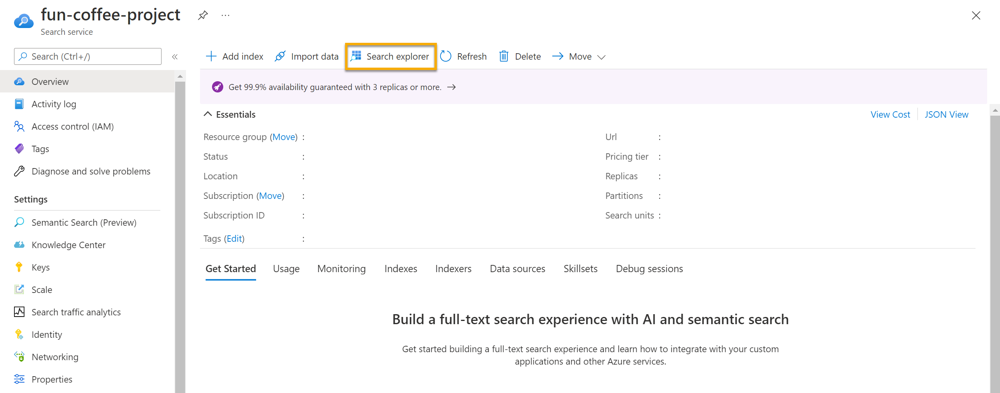
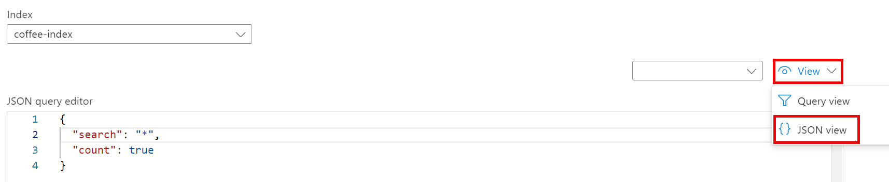
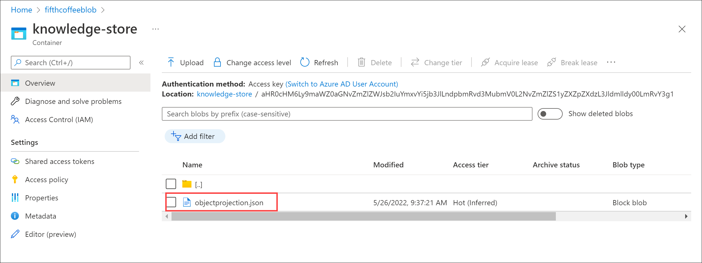
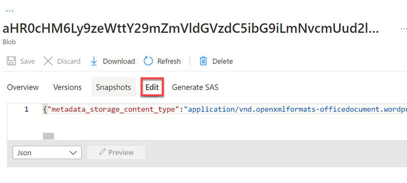
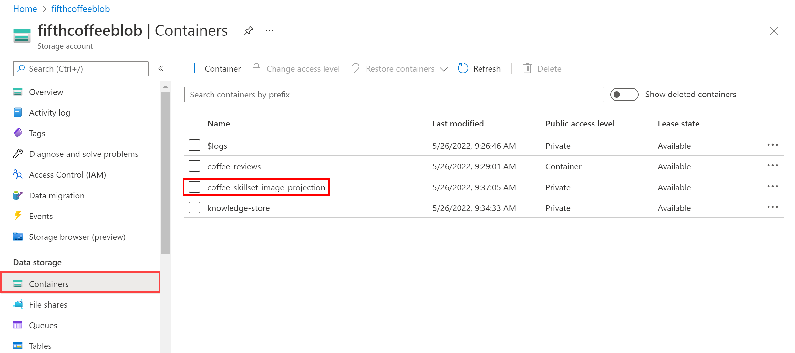
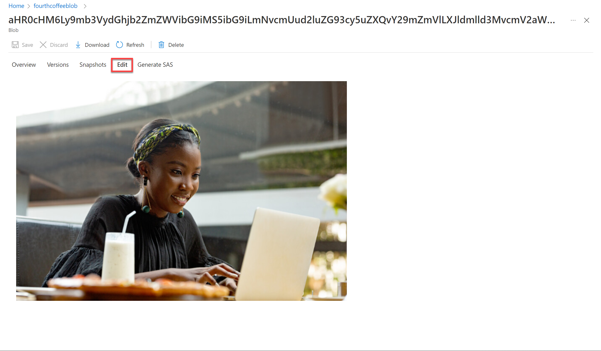

# Recursos de IA Azure para mineração de conhecimento, eriquecimentos de dados e consultas avançadas.

## Pesquisa cognitiva do Azure 

A mineração de conhecimento é muito importante principalmente para entidades que lidam com uma grande quantidade de arquivos, documentos, acervos, etc.
Depois da digitialização desse grande volume de arquivos se faz necessário o próximo passo que é otimizar as pesquisas para obtenção de informações utéis para os interessados tais como por exemplo o SUS que depois de digitalizar os prontuários dos pacientes agora podem contar com as IA's para uma pesquisa mais objetiva; temos também órgãos públicos e governamentais, bibliotecas, escritórios de advocacia, vários tipos de empresas e aplicativos também, todos se beneficiarão das IA's para obtenção de conhecimentos de maneira mais rápida e eficiênte. A mineração de conhecimento ENCONTRA INFORMAÇOES IMPORTANTES EM ESCALA.

## O Azure Cognitive Search é a plataforma de mineração de conhecimento alimentado por IA do Azure.

Utiliza um mecanismo de pesquisa (Vetor, texto, palavras ou frases-chave) que ajude a achar o que está sendo buscado, procurado de forma rápida por meio de indexação para fazer uma busca estratégica e também pela sintaxe para fazer buscas avançadas por meio de códigos eficientes.

### Soluções de Pesquisa 

INGESTÃO DE DADOS:

Blob Storage Containers - reconhece qualquer tipo de documento, imagem, PDF, etc.

Data Lake Storage - repositório de dados.

Table Storage - trabalha com tabelas.

ENRIQUECIMENTO E ÍNDICE DE IA:

Será preciso vetorizar os dados para uma pesquisa mais eficiente.
Permite uma compreensão mais profunda, processamento de linguagem natural e a indexação torna o conteúdo pesquisável. Enriquecimento da Inteligencia Aartificial por meio dessas habilidades cognitivas agrupa, vetoriza e pesquisa, consultas avançadas. É preciso estruturar um modelo de pesquisa que faça sentido para o objetivo a ser alcançado ou seja, por oderm alfabética, crescente, data, tema, grau de importância, etc.
O formato de visualização do Azure é JSON.
O conteúdo enriquecido é criado por conjunto de habilidades como reconhecer entidades e traduzir textos juntamente com análise de sentimentos.
Um conjunto de habilidades produz documentos enriquecidos que são consumidos durante a indexação e os dados serializados são passados ao mecanismo de indexação ou seja, entrada, processamento e sáida de dados de qualidade de maneira eficiente e estratégica em larga escala.

## Vamos explorar o índice do Azure IA

### Vá no portal da [Azure](https://portal.azure.com/?azure-portal=true), criar recurso, em serviços de IA do Azure, criar, e siga as instruções dessa [Documentação](https://microsoftlearning.github.io/mslearn-ai-fundamentals/Instructions/Labs/11-ai-search.html) e siga as instruções.

Vamos usar o exemplo da documentação acima para exercitar, imaginemos que você trabalha para a Fourth Coffee, rede nacional de cafés. Você foi solicitado a ajudar a criar uma solução de mineração de conhecimento que facilite a busca de insights sobre as experiências dos clientes. Você decide criar um índice do Azure AI Search usando dados extraídos de avaliações de clientes.

A solução que você criará para o Fourth Coffee requer os seguintes recursos na sua assinatura do Azure:

 #### Azure AI Search
 que gerenciará a indexação e a consulta
 #### Serviços de IA do Azure
 que fornece serviços de IA para habilidades que sua solução de pesquisa pode usar para enriquecer os dados na fonte de dados com insights gerados por IA.
 #### Uma conta de armazenamento
 om contêineres de blobs, que armazenará documentos brutos e outras coleções de tabelas, objetos ou arquivos

Seguindo o passo a passo da [Documentação](https://microsoftlearning.github.io/mslearn-ai-fundamentals/Instructions/Labs/11-ai-search.html) você fará uma série de configurações portanto, depois de criar os recursos de IA, carregaremos os documentos, que contém as opniões dos clientes, para o armazenamento do Azure (para extrair insights dos mesmos) e criaremos índices a indexadores para pesquisas no do Azure AI Search.

A seguir consultaremos os índices e faremos pesquisas utilizando o editor de consultas JSON

Editor de consultas JSON onde faremos testes inserindo códigos para pesquisar localização e sentimentos dos documentos com as opinões dos clientes

Podemos verificar o poder do armazenamento de conhecimento em ação. Ao executar o assistente Importar dados, você também criou um armazenamento de conhecimento. Dentro do armazenamento de conhecimento, você encontrará os dados enriquecidos extraídos pelas habilidades de IA que persistem na forma de projeções e tabelas. 

No painel do menu esquerdo, selecione Containers e selecione o contêiner de armazenamento de conhecimento Selecione qualquer um dos itens e clique no arquivo objectprojection.json

Em Containers , selecione o contêiner coffee-skillset-image-projection . Selecione qualquer um dos itens

Selecione qualquer um dos arquivos .jpg . Selecione Editar para ver a imagem armazenada no documento

Navegador de armazenamento no painel esquerdo e selecione Tabelas. Há uma tabela para cada entidade no índice.
Veja palavras e frases-chave que o armazenamento de conhecimento pode capturar do conteúdo das avaliações. Muitos dos campos são chaves, portanto você pode vincular as tabelas como um banco de dados relacional. Outro campo mostrará as frases-chave que foram extraídas pelo conjunto de habilidades.

### Considarações finais

Hoje a informação é uma das principais armas para o sucesso das empresas e eficiencia de entidades governamentais onde decisões importantes podem ser tomadas mais rápidamente o que fará diferença entre o fracasso e o sucesso ou, até mesmo entre vida ou morte. 

## Referências

[Portal Azure](https://portal.azure.com/?azure-portal=true)

[Microsoft](https://microsoftlearning.github.io/mslearn-ai-fundamentals/Instructions/Labs/11-ai-search.html)

[DIO.me](https://www.dio.me/pro/tech-week?source=google-ads-search-tech-week&utm_source=google-ads&utm_medium=cpc&utm_content=s1&utm_term=search&utm_campaign=tech-week&gad_source=1&gclid=CjwKCAjw5ImwBhBtEiwAFHDZx7f-eHpYAVsHe6KFcWI4Qe8HYr021iqwiJfhhjDqxFIFuqWXpWcEEBoCnrsQAvD_BwE)